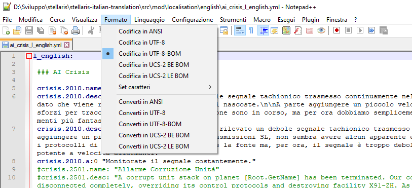
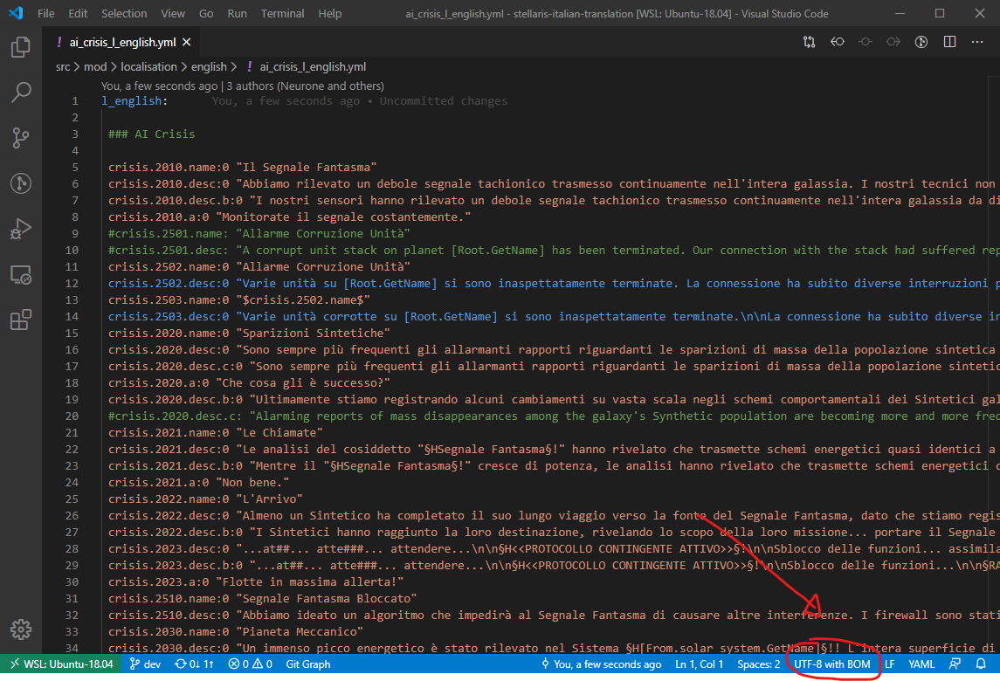
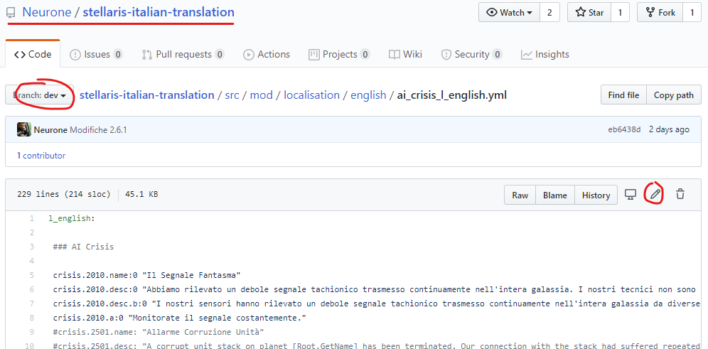
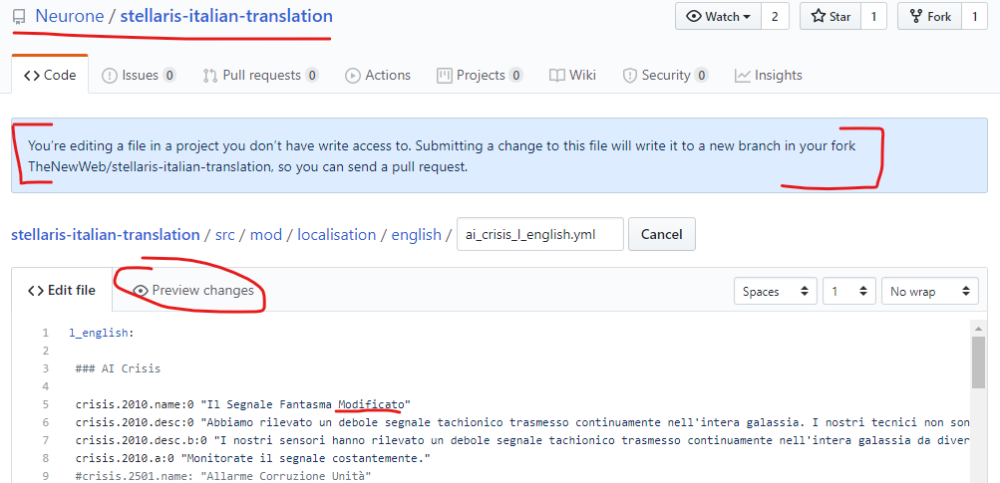
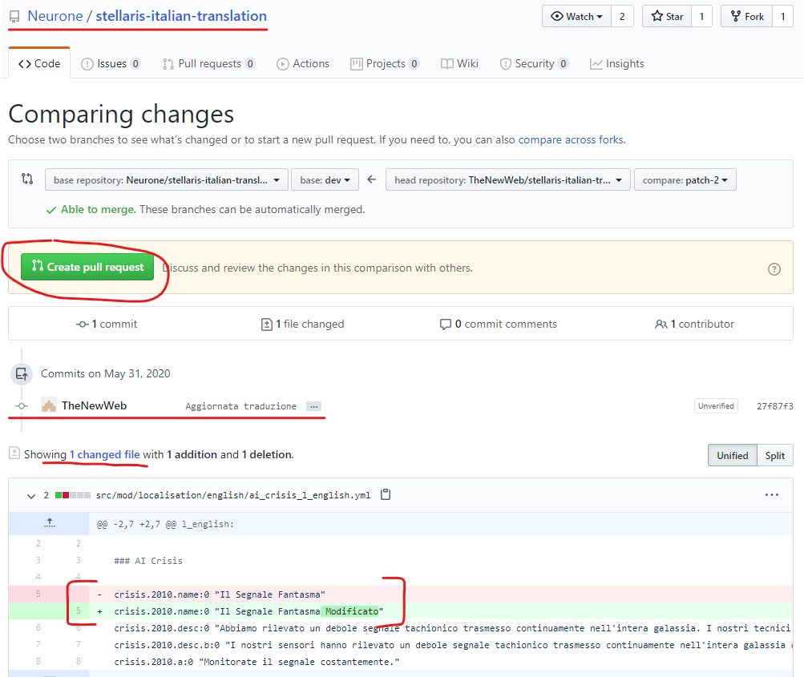
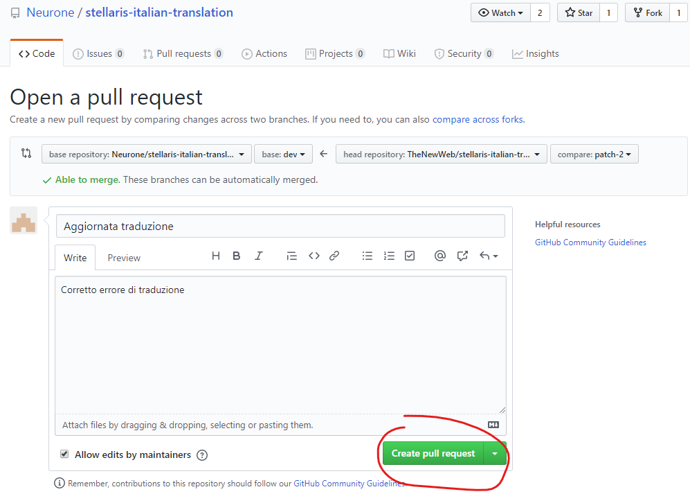
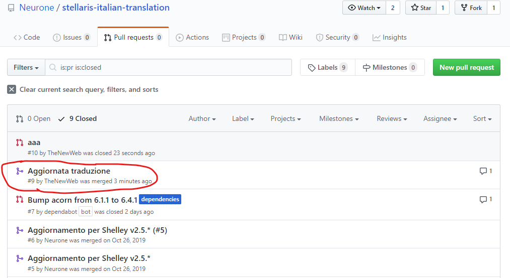

# Traduzione italiana di Stellaris

Questo mod, **compatibile** con l'**Ironmode** e gli **achievement di Steam**, sostituisce la lingua inglese con la lingua italiana.

Compatibile con versione: **Wells 2.7.***

Sono attualmente tradotti tutti i DLC fino a Lithoids Species Pack del 24 ottobre 2019. E' da tradurre il DLC Federations (uscito il 17 marzo 2020) ed eventuali DLC successivi, più alcune frasi sparse che Paradox ha ben deciso di inserire qua e là.

Benché questa traduzione sia basata in gran parte sui testi redatti diligentemente dal team [Battle of Paradox Italia](http://www.bopitalia.org) - ed in particolare dal buon Puxxup, **grande lavoro!** - a causa della modalità con la quale Stellaris effettua il check dei mod all'avvio, per poter conservare ironmode e achievement ho dovuto lasciare non tradotte parte delle frasi (es. nomi delle navi, nomi degli alieni, nomi delle fazioni e delle città, ecc.).

Inoltre, per facilitare il confronto con il resto del mondo, ho scelto di non tradurre il nome degli achievement ma solo la loro descrizione.

Se avete già completato gli achievement e l'ironmode, o comunque non siete interessati alla cosa, usate il [mod di Puxxup](https://steamcommunity.com/sharedfiles/filedetails/?id=823306244) per un'esperienza di traduzione completa!

## Contribuire alla traduzione

Paradox aggiorna spesso i propri prodotti, non solo aggiungendo nuovi DLC e nuovi dialoghi, ma anche correggendo dove e quando serve quelli vecchi. Questo significa che è difficile avere una traduzione sempre aggiornata al 100% all'ultima release, quindi ogni aiuto con le traduzioni è ben accetto :)

Per come è strutturato il gioco, e poiché questo mod vuole mantenere gli achievement attivi, non è possibile aggiungere una lingua al gioco: l'unica alternativa per avere l'italiano è modificare una delle lingue disponibili. Per comodità quindi questo mod sovrascrive direttamente la lingua di default, ossia l'inglese. La fonte principale di frasi da tradurre di trova all'interno della cartella [src/mod/localisation/english](src/mod/localisation/english).

### Chiavi e valori

Ogni file contiene delle stringhe formate da una chiave, uguale per ogni linguaggio, e dalla sua traduzione corrispondente. Es., all'iterno del file [ai_crisis_l_english.yml](src/mod/localisation/english/ai_crisis_l_english.yml) si trova la linea:

```yml
crisis.2010.name:0 "Il Segnale Fantasma"
```

In questo caso `crisis.2010.name:0` è la chiave, mentre `"Il Segnale Fantasma"` è la traduzione. Da notare i doppi apici `"` che delimitano il valore vero e proprio della traduzione, in questo caso già tradotto.

### Commenti
Le linee che iniziano con il carattere speciale `#` sono dei commenti o delle frasi non più utilizzate. **Non sono da tradurre** perché non verranno mai visualizzate all'interno del gioco.

### Una riga, una traduzione
Non andate a capo durante la traduzione di un testo. Se serve andare a capo, si utilizza il doppio carattere speciale `\n\n` Lo vedrete utilizzare anche nella frase originale inglese, ma potrete usare il carattere per andare a capo in italiano dove preferite, non necessariamente nella stessa posizione della frase originale.

### Caratteri speciali
Alcune frasi contengono caratteri speciali quali `§H` oppure `§!`. **Non devono essere tradotti o rimossi**, il gioco li utilizza per dare enfasi alle frasi del gioco. Immaginate come se fossero dei delimitatori per le parole da mettere in grassetto, con `§H` che significa inizio grassetto e `§!` fine grassetto

### Variabili
Alcune frasi contengono delle variabili che possono essere racchiuse tra parentesi quadre - ad esempio `[Root.Capital.GetName]` - o dal carattere del dollaro - ad esempio `$ancrel.8010.intro$`. Queste parole **non vanno tradotte**: il gioco le sostituirà automaticamente in tempo reale con il valore corretto. **NOTA:** Alcune variabili in italiano vi creeranno problemi, in particolare tutte quelle che prevedono un articolo davanti, perché in italiano non sappiamo esattamente quale usare in anticipo. Prendete ad esempio la seguente frase:

```yml
mirror_trade_reply:0 "I was about to suggest that myself, for the benefit of all [Root.Owner.Species.GetNamePlural]!"
```

La traduzione corretta sarebbe:

```yml
mirror_trade_reply:0 "Stavo per suggerirlo io stesso, a beneficio di tutti/e i/gli/le [Root.Owner.Species.GetNamePlural]!"
```

Come potete notare, in inglese `the`, `of all`, ecc. funzionano praticamente sempre bene per tutto - _...of all Humanoids_, _...of all Reptilians_, ecc. - ma in italiano la specie potrebbe essere ad esempio "i Rettiliani", "gli Umanoidi", ecc. E questo solo per citare le specie esisteni e definite all'interno del file [name_lists_l_english.yml](src/mod/localisation/english/name_lists_l_english.yml). Ma in questo gioco anche l'utente può definire le sue specie personalizzate, quindi non lo sapremo mai con certezza a priori. Il gioco possiede variabili per il singolare e il plurale, ma non ad esempio per la differenza tra gli articoli da utilizzare.

Una possibile soluzione è quella di prenderci qualche libertà durante la traduzione e scrivere ad esempio:

```yml
mirror_trade_reply:0 "Stavo per suggerirlo io stesso, a beneficio di tutto il popolo [Root.Owner.Species.GetAdj]!"
```

In questo caso non solo ho aggiunto la parola `popolo`, ma ho usato la variabile utilizzata per definire l'aggettivo caratteristico della specie. All'interno del gioco quindi questa frase verrebbe tradotta con `popolo Rettiliano` o `popolo Umanoide`.

In generale, se vi trovate in una impasse sulla possibile traduzione, provate a vedere come è stato fatto in altri punti e seguite la stessa strada. Altrimenti aprite una segnalazione sul repo e discutiamo delle possibili traduzioni.

### Codifica dei caratteri
**La codifica dei caratteri (charset) deve essere UTF-8**. Per sicurezza utilizzate direttamente un editor di testo che supporti più charset come ad esempio [Notepad++](https://notepad-plus-plus.org/downloads/) e il charset corretto verrà riconosciuto senza problemi.

Da notare inoltre che i file di testo possono utilizzare dei caratteri speciali all'inizio per determinare l'ordine di scrittura dei byte (il [BOM](https://it.wikipedia.org/wiki/Byte_Order_Mark)). Usando il metodo del _copia e incolla_ questo dettaglio è trascurabile, e solitamente anche se si modificano file esistenti l'editor non tocca il BOM se è presente. Se avete comunque un'editor che vi permette di scegliere se applicare o meno il BOM, es. Notepad++ o Visual Studio Code, optate sempre per mantenerlo.





### Ok, capito, ma come modifico i file?

Per contribuire alle traduzioni, potete clonare questo repository, aggiornare direttamente i file e poi procedere con una pull request per effettuare l'unione del vostro repository con quello principale.

Se non siete pratici di `git`, il mio suggerimento è di diventarlo :) E' veramente semplice da utilizzare e vi permette di lavorare in locale sul vostro PC.

Un'alternativa, è lavorare comunque sul vostro PC ma effettuare la proposta di modifica direttamente online. Una volta scaricato e tradotto il file che volete aggiornare:
1. Tornate su questo repository, assicuratevi di essere sul branch **dev**

1. Navigate fino al file che volete aggiornare e premete l'icona in alto a destra per la modifica, la matita che dice "Edit this file"

1. GitHub vi avverte che non avete permessi di scrittura sul repo, che verrà creato un repository uguale a questo sulla vostra utenza e che verrà creato un nuovo ramo con le vostre modifiche. A quel punto, potrete proporre una pull request sul repository principale. Fate una modifica puntuale o, in caso di modifiche multiple, direttamente copia e incolla di tutto il contenuto del vostro file aggiornato

1. premete `Previw changes` per verificare che le modifiche siano quelle che vi aspettate. Se è tutto ok, inserite un messaggio che descrive brevemente la vostra modifica e premete **Propose file change**

1. A questo punto avete aggiornato il vostro repository, e potete procedere con la proposta di unione. Premete il pulsante **Create pull request**, modificate il testo del commit - se per qualche motivo volete cambiare il testo rispetto a quanto avete inserito precedentemente - e poi premete nuovamente **Create pull request** per confermate
 
1. La vostra pull request è stata inoltrata correttamente, risulta in stato aperto (_Open_) e non dovrebbe dare errori di unione (_This branch has no conflicts with the base branch_)

1. Attendete che la PR sia accettata e unita
1. _Opzionale_. Una volta accetta la vostra PR sarà chiusa (_Closed_) e il vostro ramo con la modifica unito (_Merged_) a quello principale. Potete quindi decidere di cancellare il ramo che è rimasto nel vostro repository, visto che ha assolto al proprio compito di proporre la modifica che è stata accettata
 

## Installazione mod da release

Trovate le release già pronte del mod nell'apposita sezione [releases](https://github.com/Neurone/stellaris-italian-translation/releases). Scaricate la release che vi interessa e unzippatela all'interno della cartella:

    <%USERPROFILE%>\Documents\Paradox Interactive\Stellaris\mod

Nel caso non fosse presente la cartella `mod` potete crearla voi normalmente.

## Creazione mod da codice sorgente

Clonare il repository:

    git clone https://github.com/Neurone/stellaris-italian-translation.git

Installare le dipendenze:

    cd stellaris-italian-translation
    npm install

### Versione release

Creare il mod:

    npx grunt

L'output sarà simile al seguente:

    ~\stellaris-italian-translation> npx grunt
    npx: installed 1 in 2.252s
    Path must be a string. Received undefined
    ~\stellaris-italian-translation\node_modules\grunt\bin\grunt
    Running "clean:folder" (clean) task
    >> 91 paths cleaned.

    Running "copy:standalone" (copy) task
    Created 1 directory, copied 86 files

    Running "compress:main" (compress) task
    >> Compressed 87 files.

    Running "copy:complete" (copy) task
    Copied 1 file

    Done.

Verrà creato il file `stellaris-italian-translation-x.x.x.zip` all'interno della cartella `build\dist`, dove `x.x.x` sarà la versione corrente del mod (es. `1.0.0`).

Per installare il mod, scompattare il file all'interno della cartella:

    <%USERPROFILE%>\Documents\Paradox Interactive\Stellaris\mod

Nel caso non fosse presente la cartella `mod` potete crearla voi normalmente. La struttura finale dei file sarà la seguente:

    <%USERPROFILE%>\Documents\Paradox Interactive\Stellaris\mod\stellaris-italian-translation.zip
    <%USERPROFILE%>\Documents\Paradox Interactive\Stellaris\mod\stellaris-italian-translation.mod

### Versione sviluppo o Steam

La versione sviluppo del mod è utile per fare modifiche, test o per effettuare l'upload sullo Steam Workshop. La versione release **non permette** di fare l'upload sullo Steam Workshop.

Creare il mod in versione sviluppo:

    npx grunt dev

L'output sarà simile al seguente:

    ~\stellaris-italian-translation> npx grunt dev
    npx: installed 1 in 2.625s
    Path must be a string. Received undefined
    ~\stellaris-italian-translation\node_modules\grunt\bin\grunt
    Running "clean:folder" (clean) task
    >> 0 paths cleaned.

    Running "copy:dev" (copy) task


    Done.

Verrà creata la cartella `build\dist` e all'interno troverete un file ed una cartella:

    stellaris-italian-translation\*
    stellaris-italian-translation.mod

Per installare il mod, copiate tutto **il contenuto** della cartella `build\dist` all'interno della cartella:

    <%USERPROFILE%>\Documents\Paradox Interactive\Stellaris\mod

Nel caso non fosse presente la cartella `mod` potete crearla voi normalmente. La struttura finale dei file sarà la seguente:

    <%USERPROFILE%>\Documents\Paradox Interactive\Stellaris\mod\stellaris-italian-translation\...
    <%USERPROFILE%>\Documents\Paradox Interactive\Stellaris\mod\stellaris-italian-translation.mod
